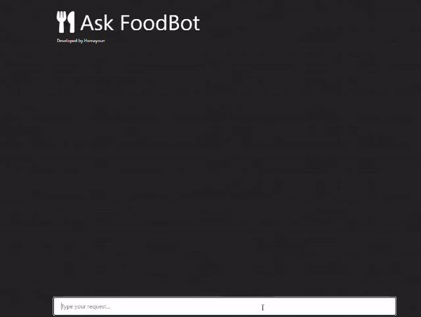

Project documentation is availabe on Medium:

https://medium.com/@homayoun.srp/building-a-chatbot-app-using-gpt2-flask-and-rag-for-a-restaurant-0cc8eb1b823a

Because of the size of the fine tuned model, I was not able to upload it here, remember to fine tune the model fist and embed the intent dataset before running the application

